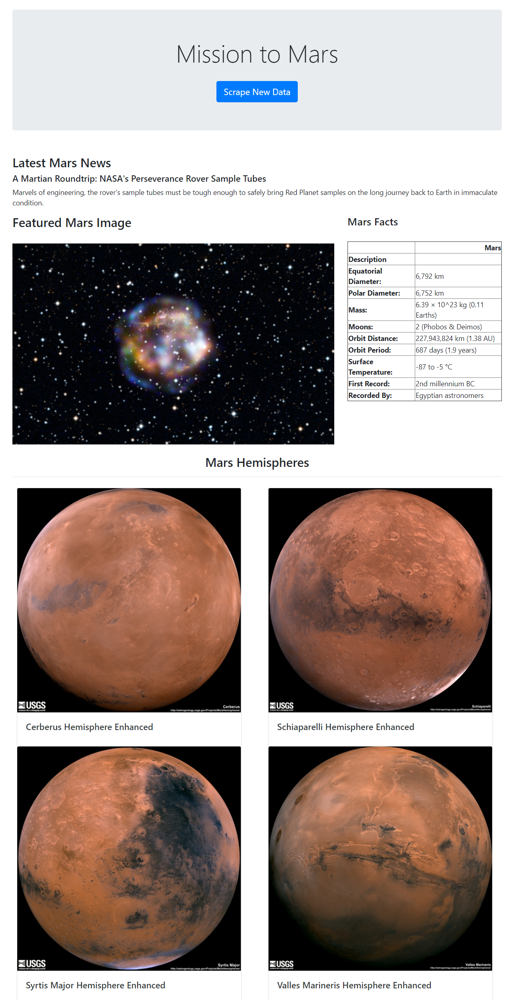

# Mission to Mars

 
For this assignment, several webpages were scraped to produce a dictionary of content used to make a Mongo Database and a Flask Application that renders an html file populated with content from the scrape
  
**Files**
 
- mission_to_mars.ipynb 
Jupyter notebook where code is run line by line to show that it's scraping the websites. Chromedriver is used to access the websites for scraping. 
 
 
- scrape_mars.py 
Contains a function which opens a browser, scrapes info from the four websites (see below), creates a dictionary with all the scraped information
 
 
- app.py 
Smallest file that took the longest! Flask app that has a home route which launches the index.html template and a scrape route which runs the scrape_mars file, writes the resulting dictionary to a pymongo database (will upsert data when rerun), redirects the user to the homepage which loads the data from the pymongo database
 
 
- index.html 
  An html page where data is displayed
  

 
 
**Technology used**
 
- Python, Jupyter notebooks
- Mongo and PyMongo 
- Flask
- Bootstrap 
 
 
 

  
Websites Scraped

    * Nasa Science - Mars Exploration Program
    For the space news headline and title text
    https://mars.nasa.gov/news/

    * NASA Jet Propulsion Laboratory  -
    For the featured image section 
    https://www.jpl.nasa.gov/spaceimages/?search=&category=Mars

    * Space Facts - Chris Jones
    For the mars facts table - taken directly from the Mars PLanet Profile table
    https://space-facts.com/mars/

    * USGS Astropedia
    For hemisphere images and their names
    https://astrogeology.usgs.gov/search/results?q=hemisphere+enhanced&k1=target&v1=Mars

  

Screenshot of the app.py running 

